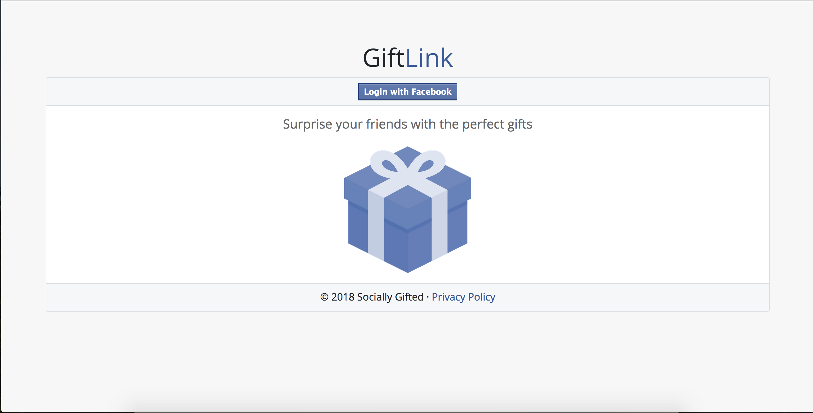

# A Software Status Report for an Intelligent Gift Planning Program
  
  **Program Name**: GiftLink 
  
  **Team Name**: Socially Gifted
  
  **Team Number**: 4
  
  **Members**:  
    
  Frankie Betancourt  
  Isaac Ige  
  Landen McDonald  
  Zack Strickland  

  
  ## Introduction
  **GiftLink** is an intelligent gift planning program that utilizes the Facebook Graph API in order to help our users find the ideal gifts for their friends and family based on that individual's Facebook likes and interests. Over the course of the last few months, the Socially Gifted team has been able to implement a minimum viable system of our **GiftLink** web application. 
  
  ### Major Features and Accomplishments:
  
  - Basic user interface to enhance the visual appeal of our application
  - Utilizing Bootstrap to make **GiftLink's** UI mobile device friendly
  - Allowing users to log into our webapp through Facebook
  - Accessing a user's friend list and displaying those that have also authorized GiftLink
  - Listing all friends' upcoming birthdays
  - Listing the friends' interests such as music, movies, sports, etc.
  - Dynamically generating and providing links to Amazon searches based on the listed interests
  - Created test users through the Facebook app dashboard
  - Drafted a privacy policy and began preparing **GiftLink** for official Facebook app review
  - Created a Facebook page for **GiftLink** with a link to the webapp
  
  ### Changes from Original Proposal:
  
  - Switched from developing a desktop application to web application
  - Utilizing Facebook's JavaScript SDK rather than the Python "Requests" module to make the appropriate HTTP requests
  - Implementing UI with Bootstrap front-end web framework rather than PyQt
  - Expanded sprint durations to accomodate additional feature implementations
  
  
  ## Customer Value
  No changes
  
  
  ## Technology
  Initially, we wanted to implement GiftLink as a desktop application using Python. This was the programming language that our team was most familiar with and there were tools available to address each aspect of the software. In theory, we thought this path would expedite development and testing since all team members had some familiarity with the tools as well as reduce the amount of interfacing (be able to make a basic GUI with PyQt and make testing easier when we start implementing the machine learning features with Tensorflow).

However, we quickly discovered that the Facebook Graph API is not very well-suited for the desktop environment and that it would be easier to begin building this software as a web application for these reasons:

 - Inconsistencies in how pywebview was behaving on different operating systems. 
 
 - There are many security practices that Facebook puts into place that proved to be cumbersome from a developer standpoint such as:
	- Preventing cross-site request forgery by having restrictions on the origins of a request to the API
	
	- Extremely limited time to grab the user's access token from the response and pywebview was not fit for the task

Instead of continuing to try and build **GiftLink** with Python, we realized that Facebook's JavaScript SDK is much more developer-friendly and greatly simplifies access to the various nodes and endpoints containing relevant user information. Upon officially adopting this new framework for **GiftLink**, we have been able to rapidly iterate through the implementation of numerous features for our product.

With a combination of various web development libraries and frameworks (Bootstrap, jQuery, Animate CSS, Google Fonts) we have created a simple user interface for our HTML webpage that intuitively allows users to find the interests of their friends and search for products relating to those interests on Amazon.

Below are a few screenshots displaying some of the progress that has been made on **GiftLink** thus far:

**Figure 1.** This is our login screen where users will connect to Facebook.

**Figure 2.** Here we see a list of the user's friends along with their interests.

**Figure 3.** Using the user's friend's likes, **GiftLink** generates a link to a potential gift idea for them.

  ### Future Goals:
  Now that Socially Gifted has been able to create a basic version of the **GiftLink** software, we are ready to move forward with implementing additional functionality and making this program a more feature-rich experience for its users. The team has agreed to focus its efforts on the following objectives as we approach the final stretch of the development process:
  
 - Update application Facebook page to appeal to potential users and better market the **GiftLink** system
 - Implement a wishlist feature for users to specify gifts that they would want themselves
 - Add calendar with upcoming birthdays and holidays to UI
 - Add simple reminders feature for upcoming gift-giving holidays
 - Submit application for app review in order to gain full access to permissions for non-developers
 - Develop and train machine learning algorithm to intelligently generate search links and suggest products based on user likes
 - Expand the online marketplace search beyond Amazon
 - Curate and reduce the list of suggested gifts to make the process more focused/seamless  
  
  
  ## Team
  **Frankie Betancourt**:
  Responsibilities:
  -API Implementation and Testing
  -Documentation
  -Code validation and debugging
  -Sprint task evaluation
  
  **Isaac Ige**: Developer
 Responsibilities / Contributions:
 - Guide the direction of development
 - Discover what resources/libraries are available that may aid development
 - Implement and test program features
 - Help explain/clarify program logic

  **Landen McDonald**: Task Supervisor
 Responsibilities / Contributions:
 - Organize group meetings, generate team objectives, and devise feature suggestions
 - Draft basic documentation such as privacy policy, README, and general api information 
 - Develop Facebook page for application
 - Create test users and begin writing test scripts accordingly
 In the future, Landen plans to slightly alter his role to become more of a feature developer for the **GiftLink** software. 
  
  **Zack Strickland**: Developer  
  Responsibilities:
  - Implement and test API features
  - Design graphical user interface to meet Facebook guidelines
  - Ensure high quality user experience
  - Code maintenance
  
  
  ## Project Management
  The development of our project is currently on schedule as described in our project proposal. Initially, we would have liked to have submitted the application for review by now, but upon reading the strict Facebook guidelines that must be met in order to have the application approved, we agreed that it would be best to polish off the formatting and UI elements first. Although we were running slightly behind schedule at the end of Sprint 2 due to the pywebview inconsistencies, the additional week that was built into Sprint 3 for Spring Break allowed the team to more than make up for the lost time.
  
  Essentially, the only issue that is currently pushed onto our backlog is the implementation of a reminder feature that notifies users of upcoming holidays. This will pair well with the addition of a calendar feature to our user interface and will likely be developed in tandem accordingly. Overall, the development of the **GiftLink** software has proven to progress well and we believe that it is fully prepared for the final phase of feature implementation.
  
  
  ## Reflection
  Ultimately, Socially Gifted had a slow start with the implementation of **GiftLink** due to the unforseen complications that arose with the development of the intended desktop framework. However, once we pivoted to the current web application design, productivity rapidly accelerated as we were able to quickly construct a functional application. Utilizing this updated framework for project development, the team is confident that **GiftLink** will continue to evolve into a user-friendly experience that offers our users unparalleled convenience and functionality.
  
  Most importantly, the Socially Gifted team has proven to be able to effectively collaborate and resolve conflicts and issues in our software in order to develop a functional application. The project workflow has been evenly divided amongst team members and we believe that we have defined a strong direction for our software moving forward. We do not plan on making any major further changes to our development plan for the final iteration of **GiftLink**.
